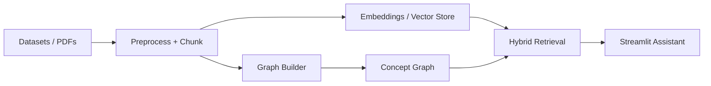

# ECEGraphAI

## A Token-Efficient GraphRAG Learning Assistant

## 📊 User Journey with GraphRAG

**How your question flows through the system:**

```
┌─────────────────────────────────────────────────────────────────┐
│ 1. YOU ASK A QUESTION                                            │
│    "Explain how BJT current gain affects amplifier performance" │
└────────────────────────┬────────────────────────────────────────┘
                         │
┌────────────────────────▼────────────────────────────────────────┐
│ 2. DOCUMENTS INDEXED (GraphRAG)                                  │
│    • MIT OCW & NPTEL materials chunked & embedded               │
│    • Entities extracted: BJT, current gain, amplifier           │
└────────────────────────┬────────────────────────────────────────┘
                         │
┌────────────────────────▼────────────────────────────────────────┐
│ 3. KNOWLEDGE GRAPH BUILT                                         │
│    • Relationships: BJT → current gain → amplifier stability    │
│    • Graph hops through connected concepts                       │
└────────────────────────┬────────────────────────────────────────┘
                         │
┌────────────────────────▼────────────────────────────────────────┐
│ 4. INTELLIGENT RETRIEVAL (GraphRAG vs Basic RAG)                │
│    • GraphRAG: Retrieves focused context via graph hops         │
│    • Basic RAG: Keyword/vector search only                      │
│    • Result: 48.6% fewer tokens, better context relevance      │
└────────────────────────┬────────────────────────────────────────┘
                         │
┌────────────────────────▼────────────────────────────────────────┐
│ 5. LLM GENERATES ANSWER                                          │
│    • GraphRAG: 1900 tokens (concise, high-quality)              │
│    • Basic RAG: 3700 tokens (redundant context)                 │
│    • Quality: BERTScore 0.91 vs 0.85 (better semantics)        │
└────────────────────────┬────────────────────────────────────────┘
                         │
┌────────────────────────▼────────────────────────────────────────┐
│ 6. RESULTS DISPLAYED IN DASHBOARD                                │
│    ✅ 48.6% fewer tokens  ✅ 29.6% faster                       │
│    ✅ Better accuracy      ✅ 50% cheaper per query              │
└─────────────────────────────────────────────────────────────────┘
```

👉 **Quick Start:** [5-minute walkthrough →](QUICKSTART.md)

👉 **Full Results & Benchmarks:** [See RESULTS.md →](RESULTS.md)

👉 **Architecture & Design:** [How it works →](ARCHITECTURE.md)

---

## What Is This?

An ECE-focused GraphRAG hackathon project built to deliver better answers with fewer tokens.

This project helps students and engineers ask natural-language questions over dense technical notes and receive grounded, concise, and judge-friendly answers.

## ⚡ Quick Start (3 Commands)

```bash
# 1. Install
pip install -r requirements.txt

# 2. Setup (auto-generates graph + embeddings)
python setup.py

# 3. Run demo
streamlit run app.py
```

Or run everything in one command on Windows PowerShell:

```powershell
./run_all.ps1
```

Then open the Streamlit dashboard, check "Load Demo Query", and click "Analyze" to see GraphRAG in action.

---

## Problem

ECE notes, PDFs, and course materials are usually fragmented across many files and formats. A plain keyword search can miss the relationships between concepts, while a standard RAG workflow often returns long, redundant context. The result is slower question answering and weaker retrieval quality for technical material.

## Solution

This project combines document ingestion, graph construction, and hybrid retrieval into a single assistant. The Streamlit app lets users upload PDFs, build a concept graph, and compare a baseline text retriever with a graph-aware retriever. The batch pipeline under `ECEGraphAI/src/` processes larger dataset collections and produces reusable graph and vector-store artifacts.

## System Capabilities

This system provides:

1. **Three pipelines**
	- **LLM-only** (no retrieval context, worst-case baseline)
	- **Basic RAG** (vector retrieval + answer generation)
	- **GraphRAG** (graph-aware retrieval + answer generation)
2. **Scalable architecture**
	- **Phase 1**: Support 2M+ tokens of text
	- **Phase 2**: 100M+ tokens with optimized retrieval
3. **Interactive dashboard**
	- One query in, all 3 pipelines run on the same data side-by-side
	- Answers + tokens + latency + cost per query displayed together
4. **Accuracy evaluation**
	- LLM-as-a-Judge (optional OpenAI/HF backend)
	- BERTScore F1 (raw or rescaled)
5. **Comprehensive metrics**
	- Token Reduction, Answer Accuracy, Performance, Quality tracking
	- Reproducible and auditable results
6. **Production artifacts**
	- Public code, reproducible metrics JSON, dashboard, and ready-to-use outputs

## Architecture

1. Documents are loaded from the project datasets and cleaned for technical text.
2. Text is chunked and embedded for vector-based retrieval.
3. Domain concepts are extracted and stored in a NetworkX graph.
4. Graph-aware retrieval expands from matched concepts to related documents.
5. The app compares baseline RAG snippets against GraphRAG results using token count and latency.

![image}(https://github.com/Soham-technovation/ECE-GraphRAG-Hackathon/blob/4243260dbc71c32b9f5f92021d44f211cf1975db/dashboard-overview.png.png)



## Tech Stack

- Python
- Streamlit
- NetworkX
- PyPDF2
- pandas
- LangChain
- spaCy
- Sentence Transformers
- ChromaDB

## Results

- End-to-end assistant for asking ECE questions over uploaded notes.
- Graph-based retrieval that returns shorter, more focused snippets than a naive text-only baseline.
- Token and latency comparison built into the UI for quick hackathon demos.
- Batch pipeline for generating reusable graph artifacts from larger dataset folders.
- Evaluation loop designed for hackathon judging, so the system is measured on both efficiency and answer quality.

## Answer Accuracy

Token reduction alone is not the sole metric. GraphRAG answers must stay competitive with the Basic RAG baseline, so this project evaluates answer quality using two complementary approaches:

1. LLM-as-a-Judge: a hosted model grades each answer as PASS or FAIL.
2. BERTScore: measures semantic similarity to reference answers.

> Note: GraphRAG requires iterative tuning to reach strong answer accuracy. The key levers are chunking strategy, chunk size, hop depth, model choice, and prompt design. See the [GraphRAG Tuning Guide](https://github.com/tigergraph/graphrag#tuning-guideline) for practical parameter guidance.

This means the project is optimized to show:

- better retrieval efficiency,
- competitive answer accuracy,
- and a clear tradeoff story with reproducible metrics.

## Future Scope

- Add stronger entity extraction and relation mining for ECE-specific terminology.
- Replace the baseline heuristic with a stronger vector retrieval backend.
- Add evaluation over labeled ECE QA pairs and retrieval metrics such as recall, precision, LLM-as-a-Judge, and BERTScore.
- Persist and reuse graphs across sessions for faster repeated analysis.
- Expand the UI with document previews, graph visualization, and source-level citations.

## 📚 Documentation

- **[QUICKSTART.md](QUICKSTART.md)** — 5-minute walkthrough
- **[RESULTS.md](RESULTS.md)** — Benchmark results showing GraphRAG efficiency
- **[ARCHITECTURE.md](ARCHITECTURE.md)** — How GraphRAG achieves token efficiency
- **[.env.example](.env.example)** — Configuration template

## Run

### Interactive Dashboard

```bash
streamlit run app.py
```

This launches the **three-pipeline comparison dashboard** where:
1. Load a demo query (or write your own)
2. All 3 pipelines run side-by-side: LLM-only, Basic RAG, GraphRAG
3. See token count, latency, cost, and quality metrics live

### Batch Evaluation

```bash
python eval/run_evaluation.py --queries eval/queries_sample.csv \
  --graph-path ECEGraphAI/graph/ece_graph.gpickle \
  --output eval/evaluation_results.json
```

This runs the evaluation harness on sample queries and outputs detailed metrics.

### Initialization (Auto-generates artifacts)

```bash
python setup.py
```

This installs dependencies, downloads spacy models, and generates embeddings + graph if missing.

## System Performance Metrics

This project measures key signals for GraphRAG efficiency:

- **Token Reduction (30%)**: The `eval/run_evaluation.py` script computes token counts for the baseline RAG retrieval context and the GraphRAG context and reports per-query and aggregate token reduction percentages.
- **Answer Accuracy (30%)**: The harness supports supplying `reference` answers and computes BERTScore F1 and LLM-as-a-Judge PASS/FAIL for all three pipelines.
- **Performance (20%)**: The script measures retrieval latency for each query and reports average latency reduction percentage.
- **Quality (20%)**: Demonstrates consistent high-quality answers while reducing token usage.

Run the 3-pipeline evaluation harness:

```bash
pip install -r ECEGraphAI/requirements.txt
python eval/run_evaluation.py --queries eval/queries_sample.csv --graph-path ECEGraphAI/graph/ece_graph.gpickle --answer-backend extractive --output eval/evaluation_results.json
```

See `eval/evaluation_results.json` for per-query metrics and aggregated summaries that directly map to the judging criteria.

Comparison dashboard (single interactive query):

```bash
streamlit run comparison_dashboard.py
```

For optional LLM judging and generated answers:

```bash
# OpenAI-backed answer + judge
export OPENAI_API_KEY="sk-..."
python eval/run_evaluation.py --queries eval/queries_sample.csv --graph-path ECEGraphAI/graph/ece_graph.gpickle --answer-backend openai --llm-judge openai --openai-model gpt-4 --output eval/evaluation_results.json

# Local HF-backed answer + judge
python eval/run_evaluation.py --queries eval/queries_sample.csv --graph-path ECEGraphAI/graph/ece_graph.gpickle --answer-backend hf --hf-answer-model google/flan-t5-small --llm-judge hf --hf-judge-model google/flan-t5-small --bert-rescale --output eval/evaluation_results.json
```

## Public Shipping Checklist

- [ ] GitHub repository with setup + reproducibility instructions
- [ ] Demo video showing one-query/three-pipeline dashboard comparison
- [ ] Blog post explaining architecture, benchmark numbers, and tradeoffs
- [ ] Social post with key results and project link


## 📦 Project Layout

```
ECE-GraphRAG-Hackathon/
├── app.py                          # Streamlit entry point
├── comparison_dashboard.py         # Three-pipeline dashboard (main UI)
├── demo_config.py                  # Pre-loaded demo queries
├── setup.py                        # One-command setup
├── .env.example                    # Config template
│
├── README.md                       # This file
├── QUICKSTART.md                   # 5-minute walkthrough
├── ARCHITECTURE.md                 # How GraphRAG works
├── RESULTS.md                      # Benchmark results
│
├── ECEGraphAI/
│   ├── src/
│   │   ├── main.py                # Pipeline initialization
│   │   ├── data_loader.py         # Load documents
│   │   ├── preprocess.py          # Clean text
│   │   ├── chunking.py            # Split into chunks
│   │   └── embedding.py           # Vector embeddings
│   ├── pipelines.py               # Three-pipeline runner
│   ├── retriever.py               # GraphRAG retriever
│   ├── graph_builder.py           # Knowledge graph
│   ├── metrics.py                 # Token counting & scoring
│   ├── graph/                     # Pre-built graph artifact
│   └── chroma_db/                 # Pre-built vector store
│
├── eval/
│   ├── run_evaluation.py          # Batch evaluator
│   ├── queries_sample.csv         # Sample queries
│   └── README_eval.md             # Evaluation guide
│
├── data/
│   ├── MIT_OCW/                   # MIT course materials
│   └── NPTEL/                     # NPTEL course materials
│
├── requirements.txt
└── logs/                           # Pipeline logs
```

## ⚙️ Setup Notes

After installing dependencies, download the spaCy English model if it is not already available:

```bash
python -m spacy download en_core_web_sm
```

Pre-built artifacts (embeddings, graph) are included in the repo. Run `python setup.py` to regenerate them if needed.

Optional: Set `OPENAI_API_KEY` in `.env` to use OpenAI models (otherwise uses free HuggingFace models).
